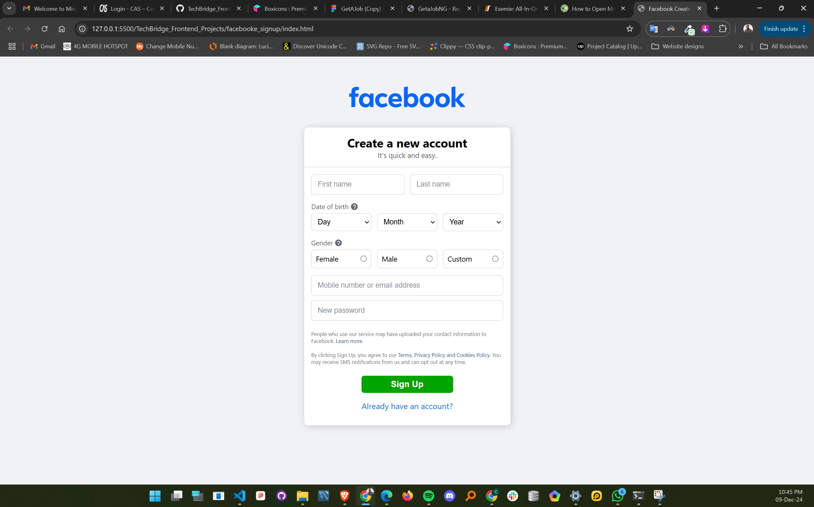

# Facebook Signup Project



## Overview

This repository contains a simple implementation of a Facebook signup feature using HTML and CSS. The project demonstrates how to create a user interface for signing up with Facebook.

## Repository Structure

-   **`index.html`**: The main HTML file that serves as the entry point for the Facebook signup interface.
-   **`style.css`**: The stylesheet that defines the visual appearance of the signup page.
-   **`src/`**: This directory contains images and assets used in the project.

## Features

-   User-friendly interface for Facebook signup.
-   Clean and responsive design.
-   Easy to integrate into existing applications.

## Getting Started

1. Clone the repository:
    ```bash
    git clone https://github.com/CJay-Cipher/TechBridge_Frontend_Projects.git
    ```
