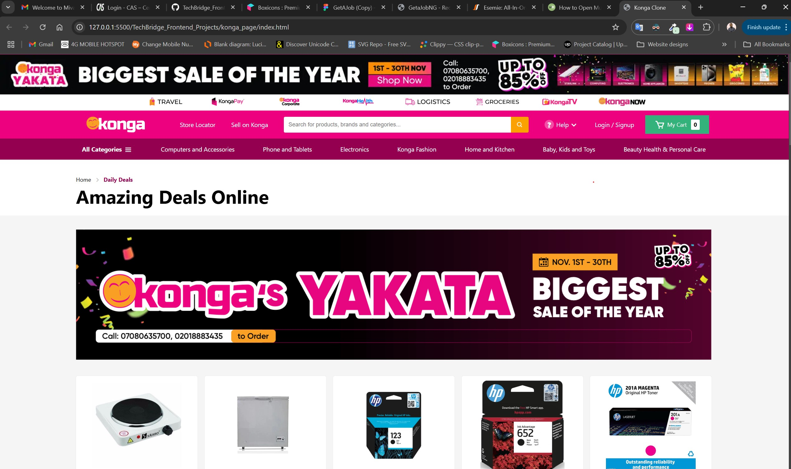
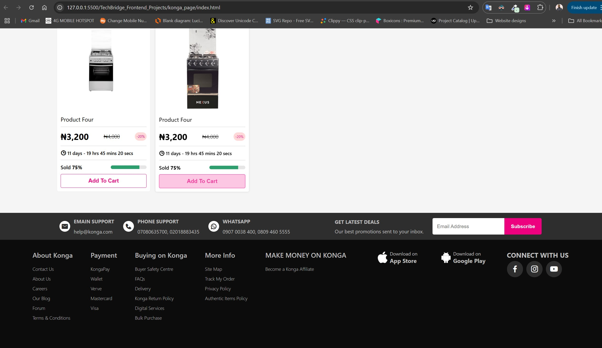

# Konga Page Clone




## Overview

This repository contains a clone of the daily deals page from Konga.com. The project is built using HTML and CSS, showcasing a similar layout and design to the original site.

## Repository Structure

-   **`index.html`**: The main HTML file that serves as the entry point for the Konga page clone.
-   **`style.css`**: The stylesheet that defines the visual appearance of the Konga page.
-   **`src/`**: This directory contains images and assets used in the project.

## Features

-   User-friendly layout for showcasing daily deals.
-   Clean and modern aesthetics.

## Getting Started

1. Clone the repository:
    ```bash
    git clone https://github.com/CJay-Cipher/TechBridge_Frontend_Projects.git
    ```
